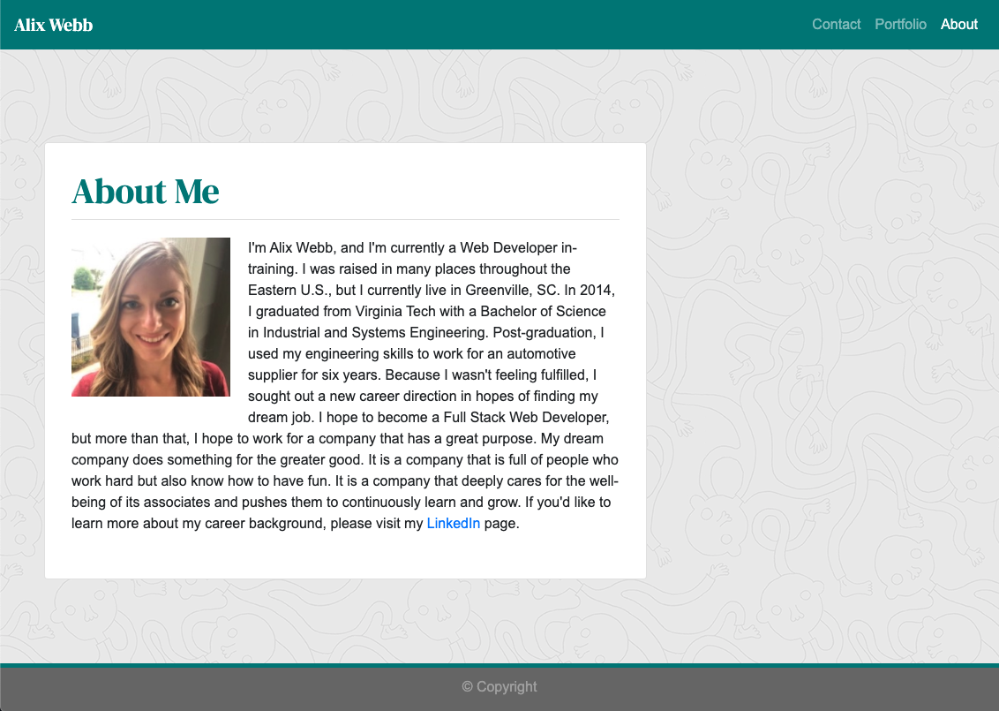

# alix-my-responsive-portfolio

## The Repository
This site is stored in the "alix-my-responsive-portfolio" repository on Alix's github account (username: awebb8). All HTML, CSS, and image files are stored here. This repository is public.  The site must be validated using an HTML validation service.

## Project Goal
Create a website utilizing Bootstrap.  Ensure usage of Bootstrap's grid system.  The site must be accessible with any screen size from xs to xl.  

## My Responsive Portfolio

## About Me
The "About" page is a brief summary of myself.  It includes a link to my personal LinkedIn page as well as a photo of myself.  The "About" page is accessible from all other pages through using the Navbar.

## Portfolio
The "Portfolio" page will eventually display images of the work I have created.  For now, while I build up my portfolio, the images are placeholders.  The "Portfolio" page is accessible from all other pages through using the Navbar.

## Contact
On the "Contact" page, site users can input their Name, Email, and a message in order to get in touch with me.  The "Contact" page is accessible from all other pages through using the Navbar.